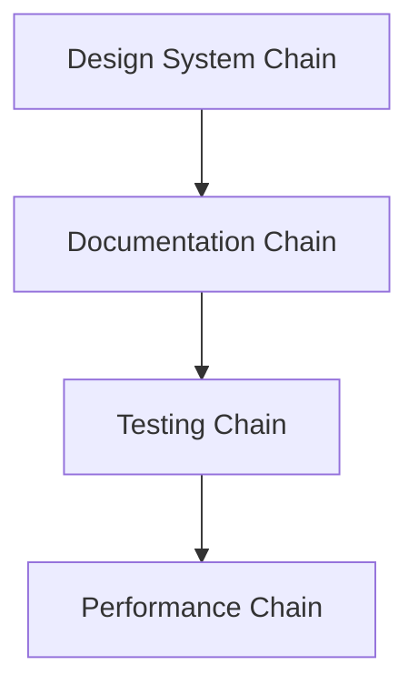
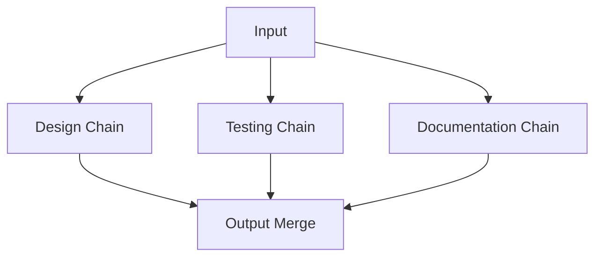
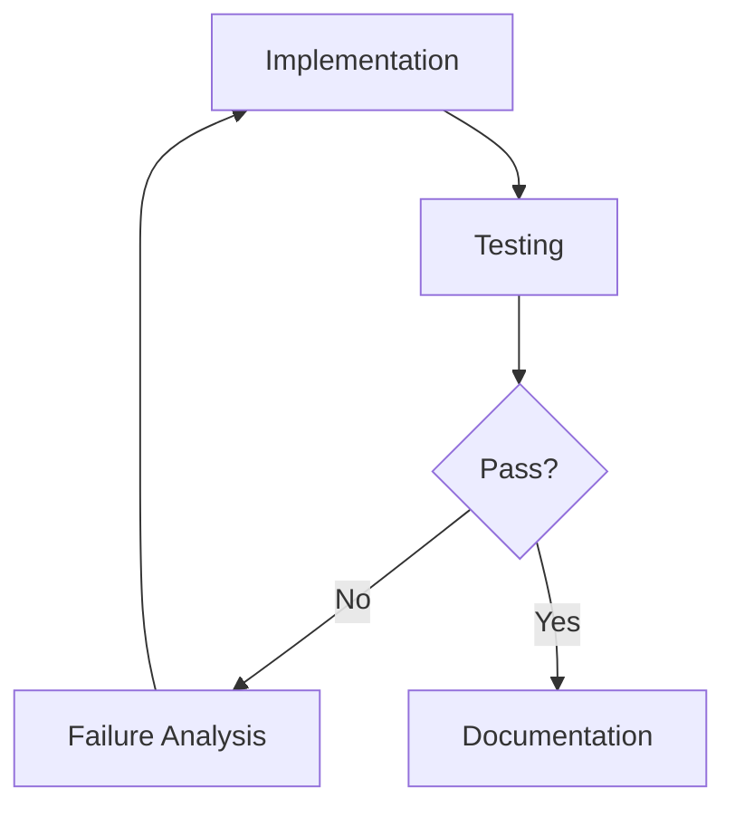
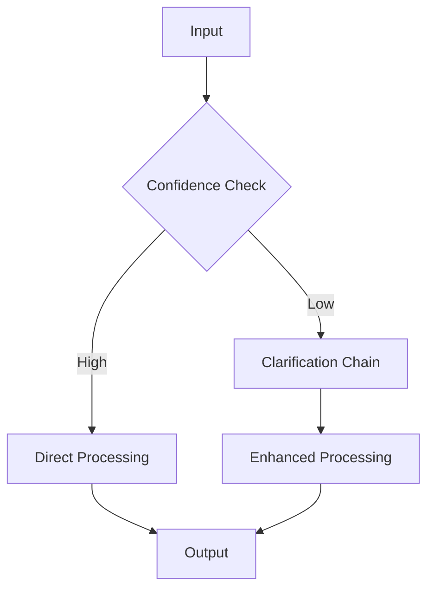

# Complex Workflow Examples

This document showcases complex workflows using Fusion V12.2's chain interactions and agent collaboration.

## 1. Design System Generation and Documentation

### Input
```json
{
  "request": "Create a design system for our new product",
  "requirements": {
    "components": ["button", "input", "card", "modal"],
    "tokens": ["colors", "typography", "spacing"],
    "documentation": "SLT-ready"
  }
}
```

### Chain Execution

1. **Design System Chain**
```json
{
  "chain": "design_system",
  "agents": [
    {
      "name": "ComponentLibrarian",
      "output": {
        "token_map": {
          "colors": { "primary": "#0066FF" },
          "typography": { "heading": "24px" }
        },
        "metrics": {
          "token_fidelity": 0.95,
          "pattern_effectiveness": 0.92
        }
      }
    },
    {
      "name": "DesignTechnologist",
      "output": {
        "components": {
          "Button": "React/Tailwind implementation",
          "Input": "React/Tailwind implementation"
        },
        "metrics": {
          "buildability_score": 0.94,
          "token_fidelity": 0.93
        }
      }
    }
  ]
}
```

2. **Documentation Chain**
```json
{
  "chain": "documentation",
  "agents": [
    {
      "name": "PromptEngineer",
      "output": {
        "usage_examples": [
          "Basic button usage",
          "Complex form patterns"
        ],
        "metrics": {
          "clarity_score": 0.96,
          "pattern_effectiveness": 0.93
        }
      }
    },
    {
      "name": "VPOfDesign",
      "output": {
        "guidelines": "SLT-ready design system documentation",
        "metrics": {
          "clarity_score": 0.95,
          "narrative_cohesion": 0.94
        }
      }
    }
  ]
}
```

## 2. Component Migration with Testing

### Input
```json
{
  "request": "Migrate legacy Button to new design system",
  "context": {
    "legacy_component": "old/Button.tsx",
    "target_system": "new-design-system"
  }
}
```

### Chain Execution

1. **Migration Analysis**
```json
{
  "chain": "migration",
  "agents": [
    {
      "name": "UXArcheologist",
      "output": {
        "legacy_analysis": {
          "patterns": ["click handling", "loading states"],
          "workflows": ["form submission", "modal triggers"]
        },
        "metrics": {
          "pattern_effectiveness": 0.91,
          "context_depth": 0.89
        }
      }
    }
  ]
}
```

2. **Testing Chain**
```json
{
  "chain": "testing",
  "agents": [
    {
      "name": "FailureAnalyst",
      "output": {
        "test_coverage": {
          "statements": 92,
          "branches": 87,
          "functions": 94
        },
        "metrics": {
          "pattern_effectiveness": 0.93,
          "clarity_score": 0.92
        }
      }
    }
  ]
}
```

## 3. Performance Optimization

### Input
```json
{
  "request": "Optimize component performance",
  "target": {
    "component": "DataGrid",
    "metrics": {
      "current_fps": 30,
      "target_fps": 60
    }
  }
}
```

### Chain Execution

1. **Performance Analysis**
```json
{
  "chain": "performance",
  "agents": [
    {
      "name": "FailureAnalyst",
      "output": {
        "bottlenecks": [
          "Unnecessary rerenders",
          "Unoptimized list virtualization"
        ],
        "metrics": {
          "pattern_effectiveness": 0.94,
          "clarity_score": 0.91
        }
      }
    }
  ]
}
```

2. **Implementation Chain**
```json
{
  "chain": "implementation",
  "agents": [
    {
      "name": "DesignTechnologist",
      "output": {
        "optimizations": {
          "virtualization": "react-window implementation",
          "memoization": "useMemo boundaries"
        },
        "metrics": {
          "buildability_score": 0.95,
          "token_fidelity": 0.92
        }
      }
    }
  ]
}
```

## 4. Accessibility Enhancement

### Input
```json
{
  "request": "Enhance component accessibility",
  "requirements": {
    "wcag_level": "AA",
    "focus_management": true,
    "screen_reader": true
  }
}
```

### Chain Execution

1. **Accessibility Analysis**
```json
{
  "chain": "accessibility",
  "agents": [
    {
      "name": "ComponentLibrarian",
      "output": {
        "a11y_requirements": {
          "aria_roles": ["button", "dialog"],
          "keyboard_nav": ["focus trap", "escape key"]
        },
        "metrics": {
          "clarity_score": 0.95,
          "pattern_effectiveness": 0.93
        }
      }
    }
  ]
}
```

2. **Implementation Chain**
```json
{
  "chain": "implementation",
  "agents": [
    {
      "name": "DesignTechnologist",
      "output": {
        "a11y_implementation": {
          "FocusScope": "React component",
          "KeyboardManager": "Hook implementation"
        },
        "metrics": {
          "buildability_score": 0.94,
          "token_fidelity": 0.93
        }
      }
    }
  ]
}
```

## Chain Interaction Patterns

### 1. Sequential Execution


### 2. Parallel Processing


### 3. Feedback Loops


### 4. Adaptive Routing


## Metrics and Quality Gates

### Success Criteria
```json
{
  "quality_gates": {
    "clarity_score": 0.95,
    "pattern_effectiveness": 0.90,
    "buildability_score": 0.90,
    "token_fidelity": 0.90,
    "coverage_score": 0.90
  }
}
```

### Fallback Behavior
```json
{
  "on_low_confidence": {
    "action": "Ask clarifying questions",
    "threshold": 0.75,
    "max_attempts": 3
  }
}
```

## Best Practices

1. **Chain Selection**
   - Use design system chain for new components
   - Use migration chain for legacy updates
   - Use testing chain after implementation
   - Use performance chain for optimization

2. **Agent Collaboration**
   - ComponentLibrarian + DesignTechnologist for implementation
   - PromptEngineer + VPOfDesign for documentation
   - FailureAnalyst + VPOfProduct for validation

3. **Quality Assurance**
   - Always run testing chain after changes
   - Use performance chain for critical paths
   - Apply accessibility chain for user-facing components
   - Run documentation chain for SLT review 